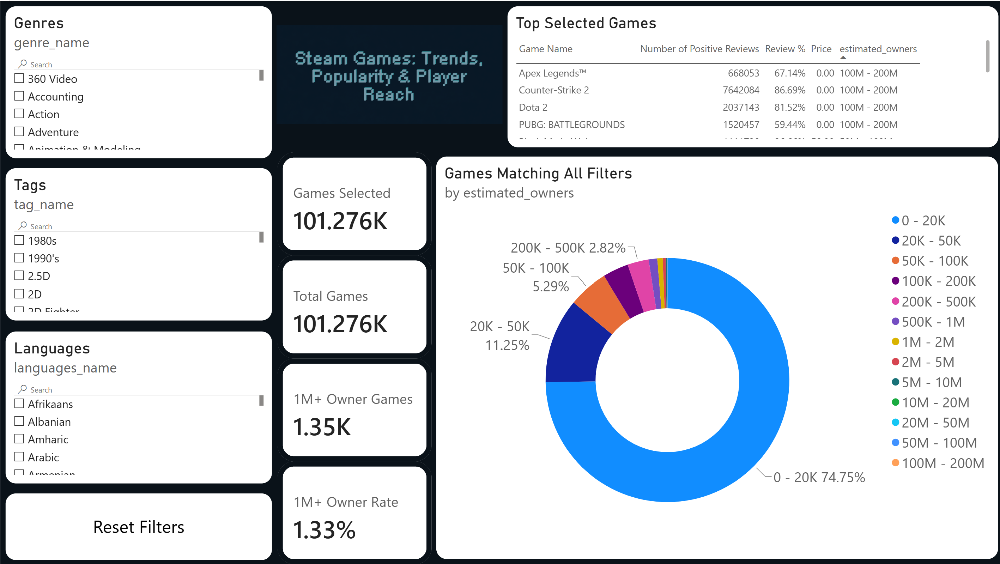

# Steam Games Ownership Analysis

**PostgreSQL · SQL · Python · Power BI**

## Overview

An end-to-end data analysis project examining **125,855 Steam games** to explore patterns in estimated game ownership.

The project combines **Python data cleaning, PostgreSQL database design, SQL analysis, and an interactive Power BI dashboard** to investigate how characteristics such as genres, tags, languages, pricing, reviews, and release year relate to game ownership.

### Main Question

> **What characteristics are associated with Steam games reaching 1M+ estimated owners?**

---

## Technologies

* **Python / Pandas** — data cleaning and exploration
* **PostgreSQL** — relational database and data storage
* **SQL** — data analysis and aggregation
* **Power BI / DAX** — interactive visualization and dashboard

---

## Data Pipeline

```text
Steam Games Dataset
        ↓
Python / Pandas
Data Cleaning & Preparation
        ↓
PostgreSQL
Database & Normalization
        ↓
SQL
Exploratory & Comparative Analysis
        ↓
Power BI
Interactive Dashboard
```

---

## Database

The dataset was normalized in PostgreSQL to separate many-to-many relationships between games and their:

* Genres
* Tags
* Languages

```text
games
  ├── game_genres ──── genres
  ├── game_tags ────── tags
  └── game_languages ─ languages
```

---

## Analysis

The SQL analysis examines:

* Steam ownership distribution
* Genre and tag patterns
* Price and ownership
* Review scores and ownership
* Release year and ownership
* Player engagement
* Language support and ownership

The complete analysis is available in [`sql/01_exploration.sql`](./sql/01_exploration.sql).

---

## Power BI Dashboard

The Power BI dashboard provides an interactive way to explore the analysis using filters for characteristics such as:

* Genre
* Tag
* Language

### Dashboard Preview



---

## Project Files

```text
Steam-Analysis/
│
├── sql/
│   └── 01_exploration.sql
│
├── images/
│   └── dashboard.png
│
├── report/
│   └── Steam_Analysis.pdf
│
├── powerbi/
│   └── Steam_Analysis.pbix
│
└── README.md
```

For the detailed methodology, findings, recommendations, and limitations, see the [full project report](./report/Steam_Analysis.pdf).

---

## Key Takeaway

This project demonstrates an end-to-end workflow for taking a large raw dataset and turning it into a **structured PostgreSQL database, reproducible SQL analysis, and interactive business intelligence dashboard**.
